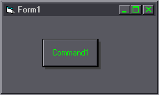

<div align="center">

## Back to simplicity: Floating CommandButtons


</div>

### Description

A lame little "3D" effect with a shape and a command button. makes it look like the button is floating above the form.. the contained code shows how to further that effect by moving the button..
 
### More Info
 
You need 1 command button and one shape.

size them both to the same size, fill the shap to a nice shadow color, and place the shape 60 twips right, and 60 twips down from the button..

if you wish the shorten/lengthen the distance, simply play with the numbers; don't forget to remove the border around the shape..


<span>             |<span>
---                |---
**Submitted On**   |
**By**             |[^DaRk^](https://github.com/Planet-Source-Code/PSCIndex/blob/master/ByAuthor/dark.md)
**Level**          |Beginner
**User Rating**    |5.0 (10 globes from 2 users)
**Compatibility**  |VB 5\.0, VB 6\.0
**Category**       |[Custom Controls/ Forms/  Menus](https://github.com/Planet-Source-Code/PSCIndex/blob/master/ByCategory/custom-controls-forms-menus__1-4.md)
**World**          |[Visual Basic](https://github.com/Planet-Source-Code/PSCIndex/blob/master/ByWorld/visual-basic.md)
**Archive File**   |[](https://github.com/Planet-Source-Code/dark-back-to-simplicity-floating-commandbuttons__1-10160/archive/master.zip)


### Source Code

```
Option Explicit
Private Sub Command1_MouseDown(Button As Integer, Shift As Integer, X As Single, Y As Single)
Command1.Left = Command1.Left + 60
Command1.Top = Command1.Top + 60
End Sub
Private Sub Command1_MouseUp(Button As Integer, Shift As Integer, X As Single, Y As Single)
Command1.Left = Command1.Left - 60
Command1.Top = Command1.Top - 60
End Sub
```

